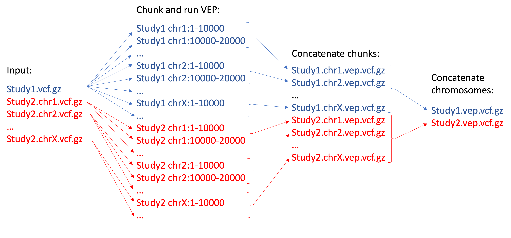

# VEP variant annotation pipeline

## Prerequisites

The following software is required:
- Singularity (tested with version 3.8.5)
- Nextflow (tested with version 21)
-  **Only when using `enable_summary = true`**. Python 3 (tested with version 3.7.7) with the following packages: pysam, nbconvert, ipykernel, pandas.

## Workflow
```diff
- Important!
@@ Your input VCFs must be indexed and have corresponding `.tbi` files @@
@@ Input VCFs from the same study must have the same prefix @@
@@ Input VCFs can be split by chromosome as long as they all have the same prefix @@
```




## 1. Installation
This section describes how to set up VEP, download all necessary cache files, and install LoFtee plugin.

### 1.1. Setting up VEP

1. Load `Singularity` module:
   ```
   module load singularity
   ```

2. Build `Singularity` image with additional tools (e.g. `samtools`, `bcftools` and `DBD::SQLite`).

   Create `vep.def` Singularity definition file with the following content:
   ```
   Bootstrap: docker
   From: ensemblorg/ensembl-vep:latest
   
   %post
        apt-get update -y
        apt-get install -y samtools
        apt-get install -y bcftools
        apt-get install -y libdbd-sqlite3-perl
   ```

   Build VEP Singularity container:
   ```
   singularity build --remote vep.sif vep.def
   ```
   
   This step may take around 1h.

3. Download VEP cache files into local `vep_cache` directory:
   ```
   mkdir `pwd`/vep_cache
   export CURL_CA_BUNDLE=/etc/ssl/certs/ca-certificates.crt
   singularity run -B `pwd`/vep_cache:/opt/vep/.vep vep.sif INSTALL.pl -a cf -s homo_sapiens -y GRCh38 -c /opt/vep/.vep
   ```
   This step may take more than 1h.

### 1.2. Setting up LoFtee

More detailed instructions on how to set up LoFtee are [here](https://github.com/konradjk/loftee).

1. You must clone LoFtee repository into your local `vep_cache` directory:
   ```
   cd vep_cache
   git clone https://github.com/konradjk/loftee.git loftee_GRCh37
   git clone https://github.com/konradjk/loftee.git loftee_GRCh38
   cd loftee_GRCh38
   git checkout grch38
   cd ..
   ```
   
2. Download all necessary databases (based on human genome build you plan to use) as described [here](https://github.com/konradjk/loftee) into your `vep_cache` directory into folders `loftee_db_GRCh37` and `loftee_db_GRCh38`. These should include: GERP conservation scores (only for GRCh38), human_ancestor.fa files, SQL databases with PhyloCSF metrics (SQL files must be unzipped).

### 1.3. Setting up CADD

1. Download VEP plugins into `vep_cache` directory:
   ```
   cd vep_cache
   git clone https://github.com/Ensembl/VEP_plugins.git Plugins
   cd ..
   ```
2. Download CADD scores for GRCh37 and GRCh38 builds
   ```
   cd vep_cache
   
   mkdir CADD_GRCh37
   cd CADD_GRCh37
   wget https://krishna.gs.washington.edu/download/CADD/v1.6/GRCh37/whole_genome_SNVs.tsv.gz
   wget https://krishna.gs.washington.edu/download/CADD/v1.6/GRCh37/whole_genome_SNVs.tsv.gz.tbi
   wget https://krishna.gs.washington.edu/download/CADD/v1.6/GRCh37/InDels.tsv.gz
   wget https://krishna.gs.washington.edu/download/CADD/v1.6/GRCh37/InDels.tsv.gz.tbi
   cd ..
   
   mkdir CADD_GRCh38
   cd CADD_GRCh38
   wget https://krishna.gs.washington.edu/download/CADD/v1.6/GRCh38/whole_genome_SNVs.tsv.gz
   wget https://krishna.gs.washington.edu/download/CADD/v1.6/GRCh38/whole_genome_SNVs.tsv.gz.tbi
   wget https://krishna.gs.washington.edu/download/CADD/v1.5/GRCh38/InDels.tsv.gz
   wget https://krishna.gs.washington.edu/download/CADD/v1.5/GRCh38/InDels.tsv.gz.tbi
   cd ..
   
   cd ..
   ```

### 1.4. Adding custom VEP plugins

1. Copy `Plugins/CONTEXT.pm` file from this repository to the `vep_cache/Plugins` directory.
   ```
   cd Plungins
   wget https://raw.githubusercontent.com/CERC-Genomic-Medicine/vep_pipeline/master/Plugins/CONTEXT.pm
   cd ..
   ```

### 1.5. Conclusion

After above steps, your local `vep_cache` directory should be similar to this:
```
|- vep_cache
   |- homo_sapiens (directory with VEP databases)
   |- loftee_GRCh37 (loftee scripts for build GRCh37)
   |- loftee_GRCh38 (loftee scripts for build GRCh38)
   |- loftee_db_GRCh37 (loftee databases for build GRCh37)
   |- loftee_db_GRCh38 (loftee databases for build GRCh38)
   |- Plugins (CADD plugin)
   |- CADD_GRCh37 (CADD scores for build GRCh37)
   |- CADD_GRCh38 (CADD scores for build GRCh38)
```

## 2. Running

1. Clone this repository to the directory where you will run the pipeline:
   ```
   git clone https://github.com/CERC-Genomic-Medicine/vep_pipeline.git
   ```

2. Modify `nextflow.config` configuration file.
     * `params.vcfs` -- path to your VCF/BCF file(s). You can use `glob` expressions to selecect multiple files.
     * `params.assembly` -- set to "GRCh37" or "GRCh38".
     * `params.vep_cache` -- full path to your local `vep_cache` directory.
     * `params.vep_flags` -- flags you want to pass to VEP.
     * `params.loftee_flags` -- comma-separated list of additional LoFtee flags (with leading comma). Flags `loftee_path`, `gerp_bigwig`, `human_ancestor_fa`, and `conservation_file` are set automatically based on the selected `assembly`.
     * `enable_summary` -- set to `true` if you want to generate HTML summary files.
     * `process.container` -- full path to the `Singularity` image file (see step 1.1.).
     * `executor.$slurm.queueSize` -- maximal number of SLURM jobs to submit at once.
  
3. Run pipeline:
   ```
   module load nextflow
   module load singularity
   nextflow run Annotation.nf -w ~/scratch/work_directory
   ```
   Important: when working on Compute Canada HPC, set working directory to ~/scratch/\<new directory name\>. This will speed up IO and also save space on your `project` partition. After the execution, if there were no errors and you are happy with the results, you can remove this working directory.
  
## 3. Known pitfalls

1. You may not be able to execute `nextflow` directly from the Compute Canada login nodes due to the 8Gb memory limit per user. One alternative is to start interactive slurm job and submit all commands from it e.g.:
   ```
   salloc --time=2:00:00 --ntasks=1 --mem-per-cpu=16G
   ```
   Or submit a batch job with nextflow command e.g.:
   ```
   module load nextflow
   module load singularity
   sbatch --time=2:00:00 --ntasks=1 --mem-per-cpu=16G --wrap="nextflow run Annotation.nf -w ~/scratch/work_directory"
   ```
   Make sure you specify enough time. VEP annotation is typically fast, but total `nextflow` execution time will depend on how busy the SLURM queue is.

2. Sometimes `nextflow` will crash with error `Failed to submit process to grid scheduler for execution`. Most probably the SLURM queue was too busy and thus slow to respond. Your results were not lost, just resume `nextflow` execution with the following command and `nextflow` will continue from where it finished:
   ```
   nextflow run Annotate.nf -w ~/scratch/work_directory -resume
   ```
   
3. If `nextflow` crashes with error `libnet.so: failed to map segment from shared object`, then try to increase the amount of memory in your `salloc` or `sbatch` job.
